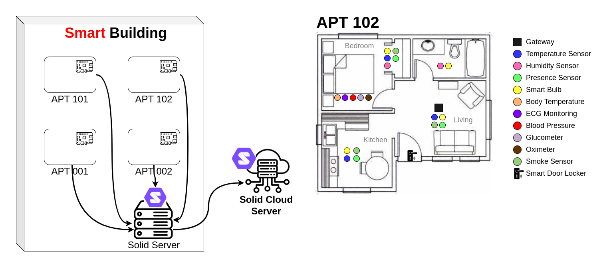

# FoT Home Simulator
Data privacy involves protecting personal information from unauthorized access, use, and sharing. Privacy violations can lead to harm, such as identity theft, financial fraud, and the exposure of personal information that could damage a person's reputation and security. The advent of IoT technologies has enriched our daily lives by enabling interconnected devices to generate and collect an increasing amount of data and enabling the creation of more personalized and valuable services. While the IoT promotes many benefits in our everyday lives, from financial transactions to personal communications, it makes personal information even more vulnerable to access by unauthorized third parties worldwide. Its technologies and characteristics have the potential to amplify privacy issues, posing a trade-off between the convenience of the technology's diverse services and users' privacy concerns.

Here, we present a simulation of our proposal, named [FoT-PDS](https://onlinelibrary.wiley.com/doi/abs/10.1002/itl2.512), to address privacy issues in IoT. We adopt a Personal Data Store (PDS) as the storage mechanism and leverage its associated benefits: control, transparency, trust, and awareness. We argue that a PDS serves as a solution to mitigate privacy issues in IoT. A PDS refers to a secure and private repository service dedicated to managing the user's data, allowing them to store, manage, and share personal data and digital assets while controlling who can access and utilize them. In short, the basic idea is that the data remains under the user's control, and any use or processing will only occur with their explicit consent.

As depicted in Figure 1, our proposed scenario encompasses a monitored building and apartments through smart devices. The generated and collected data from devices are stored in your PDS (we are using the [Community Solid Server](https://github.com/CommunitySolidServer/CommunitySolidServer)), and you maintain control over the dissemination, storage, and usage.



Here, you can find and manage:

- Your data profile;
- Your sensor's data;
- Your clouds' repositories;
- Your granted consent.

This simulation is composed by three components
1. [FoT Simulator](https://github.com/georgepacheco/fot-home-simulator/tree/master/sim)
2. [MQTT Server](https://github.com/georgepacheco/fot-home-simulator/tree/master/mqtt_server)
3. [Solid Server](https://github.com/georgepacheco/fot-home-simulator/tree/master/solid_server)


## Prerequisites

We need to install some tools to run the simulator:

### Docker 27.1.2 or later

### Docker Compose V2.28.1 or later
```bash
# install latest version
$-> sudo curl -L https://github.com/docker/compose/releases/latest/download/docker-compose-$(uname -s)-$(uname -m) -o /usr/local/bin/docker-compose

# Fix permissions after download
$-> sudo chmod +x /usr/local/bin/docker-compose

# Verify success
$-> docker-compose version
```

### NVM
```bash
$-> curl -o- https://raw.githubusercontent.com/nvm-sh/nvm/v0.39.7/install.sh | bash
```

### Node V20 or later

```bash
# intall node
$-> nvm install 20

# verifies the Node.js version
$-> node -v 

# verifies the NPM version
$-> npm -v 
```

## Installation

Steps to install and run the simulator. Follow the steps in the order indicated.

1. Configure the server machine's firewall to allow external connections. In terminal:
    
    ```bash
    # verify the firewall open ports
    $-> sudo ufw status

    # open specific firewall ports
    $-> sudo ufw allow 3000/tcp

    # enable the firewall
    $-> sudo ufw enable 
    ```

2. Clone the project.

3. Change the server IP in indicated files (see [Appendix I](#appendix-i)).

4.  After changing the IP address, go to the root folder of each project bellow and run the code to install and compile.
    ```bash
    # install dependencies
    $-> npm install

    # compile project
    $-> npm run build
    ```
    a. [Backend ](https://github.com/georgepacheco/fot-home-simulator/tree/master/solid_server/FotSolid/backend)
        
    b. [Sensor2Gateway](https://github.com/georgepacheco/fot-home-simulator/tree/master/solid_server/FotSolid/Sensor2Gateway)

    c. [fot-solid-dash](https://github.com/georgepacheco/fot-home-simulator/tree/master/solid_server/FotSolid/fot-solid-dash)

    d. [health-application](https://github.com/georgepacheco/fot-home-simulator/tree/master/solid_server/FotSolid/health-application)

5. Start the Server
    
    a. Go to [solid_server](https://github.com/georgepacheco/fot-home-simulator/tree/master/solid_server) folder.
    
    b. Run to start the Solid Server
    ```bash    
    $-> docker compose -f docker-compose-solid-v2-local.yml up -d
    ```

8. Start Gateway

    a. Go to [mqqt_server](https://github.com/georgepacheco/fot-home-simulator/tree/master/mqtt_server) folder.

    b. Run to start the Gateway.
    ```bash    
    $-> docker compose -f docker-compose-mqtt.yml up -d
    ```

9. Start the Sensors Simulation

    a. Go to [root](https://github.com/georgepacheco/fot-home-simulator/tree/master) folder.

    b. Run to start the Gateway.
    ```bash    
    $-> docker compose -f docker-compose-local_docker.yml up -d

    ```

## Appendix I

Change the server IP address in these files.

1. Docker compose file from [solid_server/docker-compose-solid-v2-local.yml](https://github.com/georgepacheco/fot-home-simulator/blob/master/solid_server/docker-compose-solid-v2-local.yml).

    - Change the IP address in the **entrypoint** directive.

2. Index.ts file in the [solid_server/FotSolid/fot-solid-dash/src/shared/environment/index.ts](https://github.com/georgepacheco/fot-home-simulator/blob/master/solid_server/FotSolid/fot-solid-dash/src/shared/environment/index.ts)

    - Change the IP address in the constants: **SIM_WEBID** and **SIM_API_URL**

3. Index.ts file in the [solid_server/FotSolid/health-application/src/shared/environment](https://github.com/georgepacheco/fot-home-simulator/blob/master/solid_server/FotSolid/health-application/src/shared/environment/index.ts) path

    - Change the IP in the constants: **AGENT_WEBID**, **URL_FILE_RESOURCE_GRANTED**, **LOCAL_WEBID**, **WEBID** and **IDP**.

4. .env file in the [solid_server/FotSolid/Sensor2Gateway/.env](https://github.com/georgepacheco/fot-home-simulator/blob/master/solid_server/FotSolid/Sensor2Gateway/.env)

    - Change the IP in the constants: **WEBID** and **IDP**.

5. Environment.ts file in the [solid_server/FotSolid/Sensor2Gateway/src/Environment.ts](https://github.com/georgepacheco/fot-home-simulator/blob/master/solid_server/FotSolid/Sensor2Gateway/src/Environment.ts)

    - Change the IP in the constants: **WEBID** and **IDP**.

6. nginx.conf in the [solid_server/nginx.conf](https://github.com/georgepacheco/fot-home-simulator/blob/master/solid_server/nginx.conf).

    - Change the IP in the: **server_name**, **proxy_pass** and **proxy_set_header**

## Appendix II

Steps to create a user and Pod on Solid Server.

1. Access https://IPSERVER:3000 (Example: https://192.168.0.111:3000)

    

2. Fill out the form and click on **Register**.

    

3. Click on **Create Pod**.

    

4. Fill out the name and click on **Create Pod**.

    